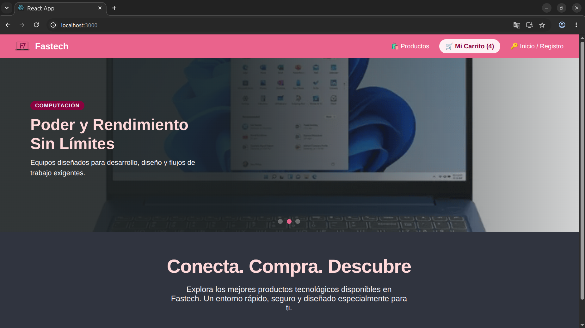
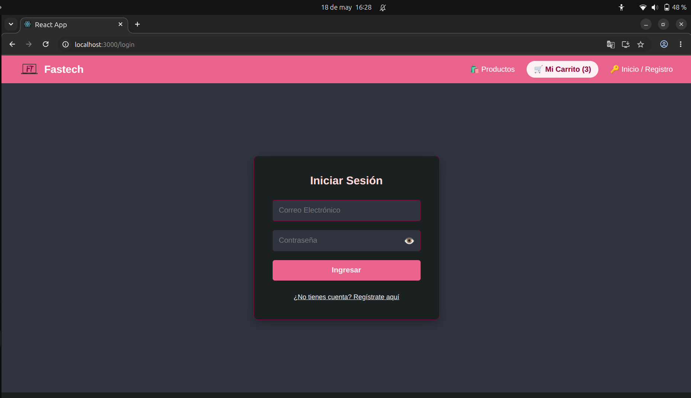
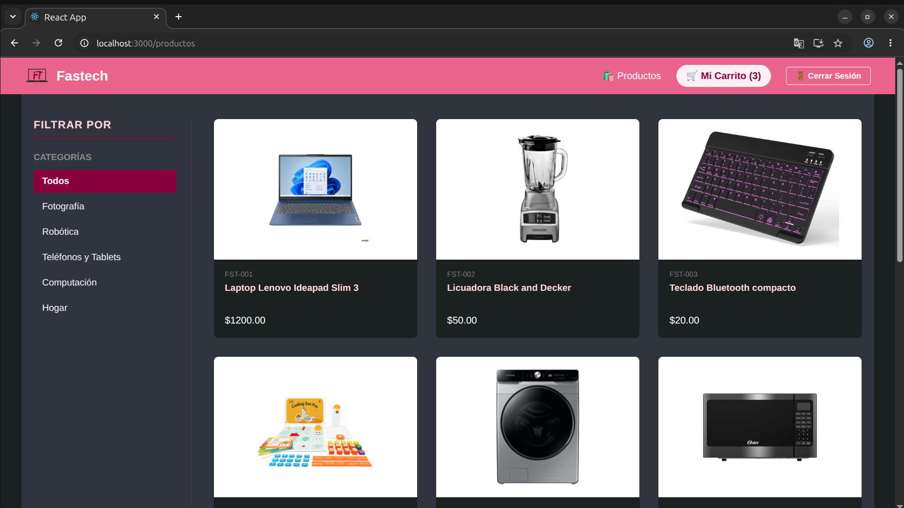
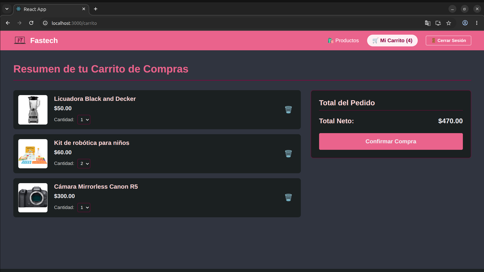
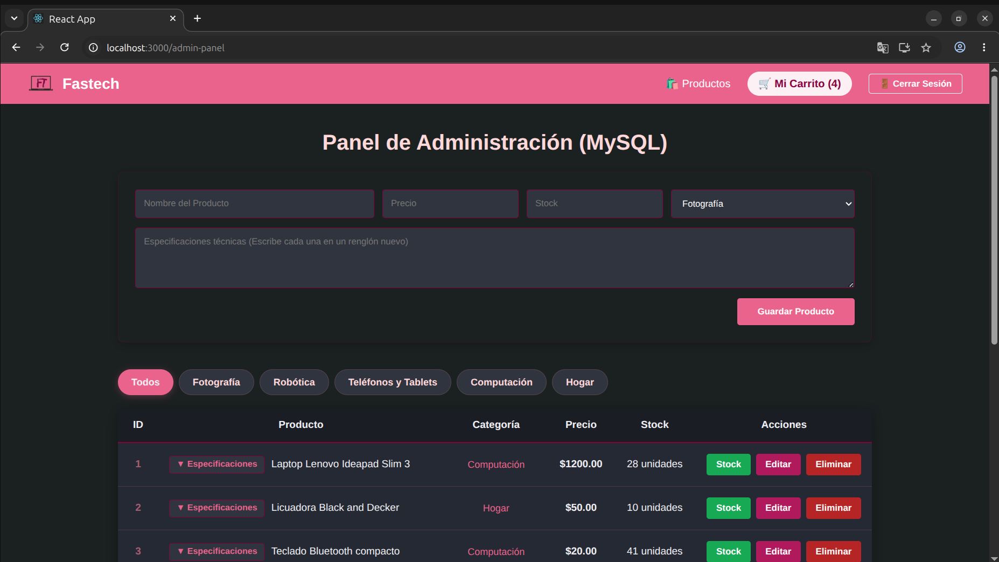

# Proyecto Fastech - Tienda de Mercancía Tecnológica

##Tabla de contenidos: -Descripción -Características -Capturas de pantalla -Tecnologías -Uso

##Descripción
El proyecto permite al usuario mediante una aplicación web, realizar la compra (de manera simulada) de productos tecnológicos, de una manera sencilla y rápida, es útil para simular la experiencia de usuario en tiendas online de comercio electrónico, ya que también cuenta con una gestión de inventario.

##Características
- Tiene una interfaz atractiva (paleta de colores con tonos rosas y negros).
- Utiliza MySQL para guardar los datos de usuarios y productos.
- Cuenta con un panel de administración de inventario exclusivo para administradores.
- Utiliza un servidor local para hacer la experiencia más interactiva

##Capturas de pantalla

###Inicio de la página

###Página de Login

###Página de productos

###Carrito

###Página de inventario

#Tecnologías
- **Frontend:** React.js, React Context API (para la gestión global del carrito), CSS / Estilos personalizados (Paleta: Rosado y Negro).
- **Backend:** Node.js, Express.js.
- **Base de datos:** MySQL (Gestión de persistencia para productos, stock y categorías).

#Uso
##Flujo principal de la aplicación
1. **Explora el catálogo:** Navega por las diferentes categorías de productos.
2. **Selecciona un producto:** Agrega un producto al carrito para reservarlo.
3. **Compra el producto:** Después de revisar todas las especificaciones del producto, desde tu carrito presiona el botón de "Comprar".
